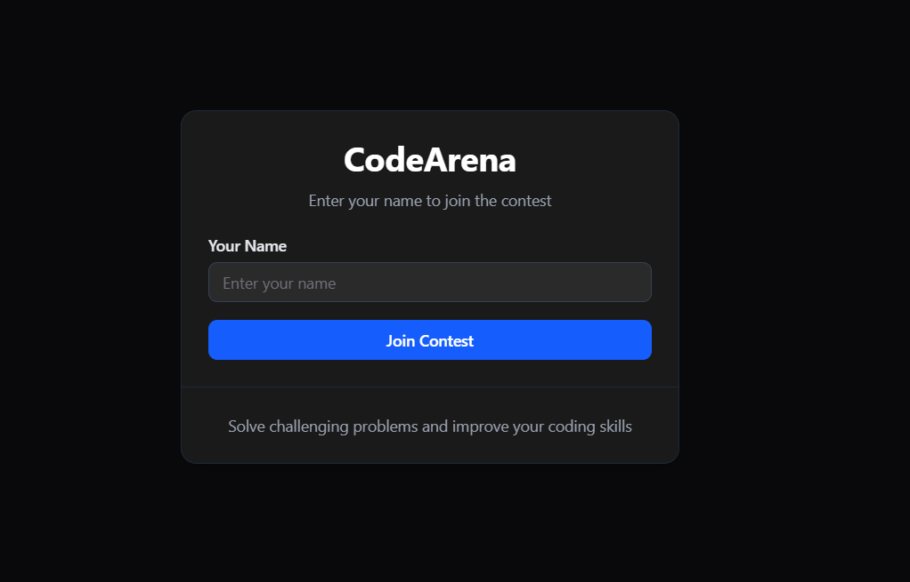
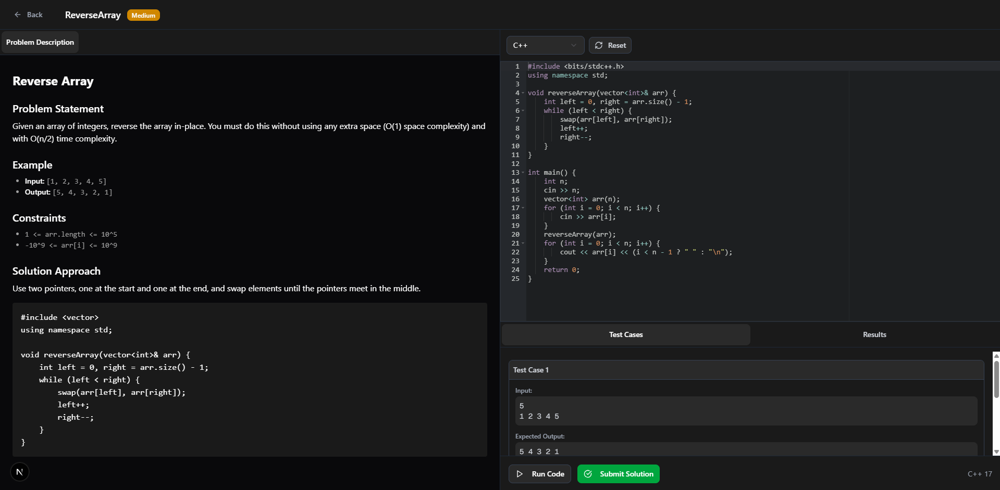
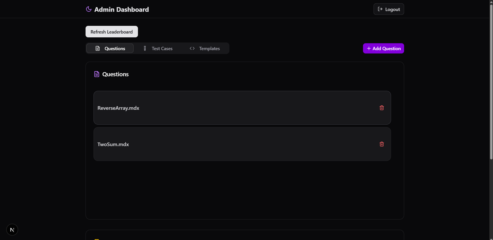
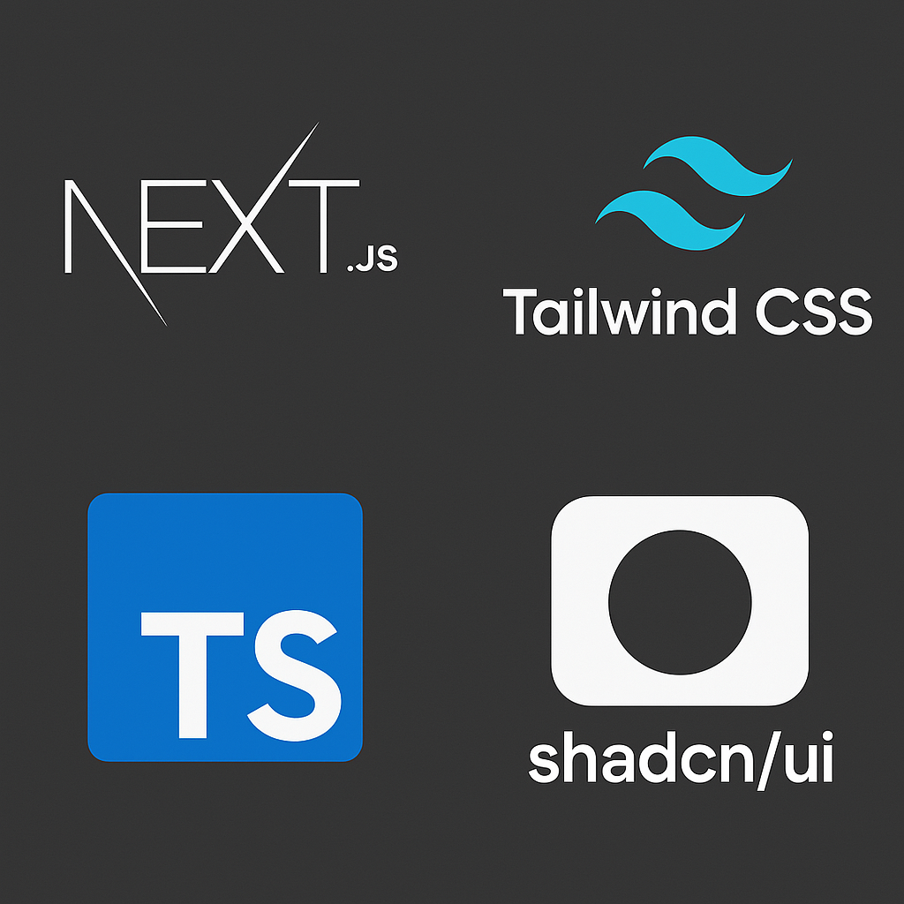
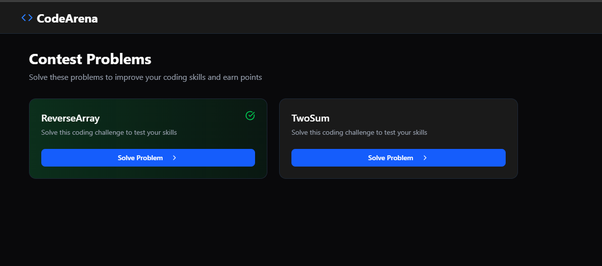
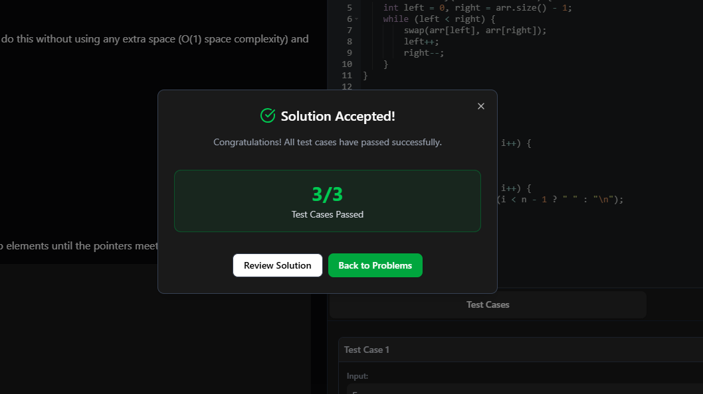
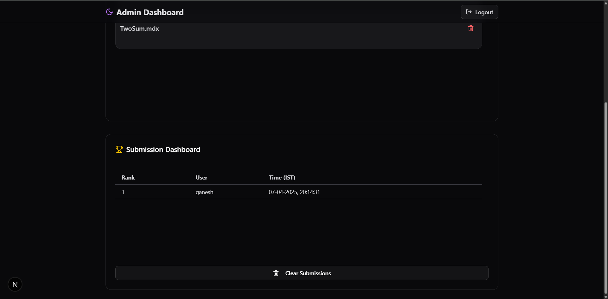

# ✨ CodeArena - Where Code Meets Competition

<div align="center">
  
</div>

> ⚡ A blazing-fast competitive programming platform that turns coding into an adrenaline-pumping experience!

## ✨ Why CodeArena?

<div align="center">
  
  
</div>

- 🎯 **Real-time Code Evaluation**
- 🛡️ **Anti-cheat Protection**
- 🏆 **Live Leaderboard**
- 💻 **Multi-language Support**
- ⚡ **Lightning-fast Execution**

## 🛠️ Tech Stack

<div align="center">
  
</div>

## 🚀 Quick Start

```bash
# Clone the repo
git clone [repository-url]

# Install dependencies
npm install

# Start the dev server
npm run dev
```

## 📱 Screenshots

<div align="center">
  
  
  
</div>

## 🔒 Security Features

- 🛡️ Tab Switch Detection
- 🔒 Copy-Paste Prevention
- 🔐 Session Management
- 🚫 Anti-Cheat System

## 📊 Project Structure

```
contest-platform/
├── app/                # Next.js app directory
├── components/         # Reusable components
├── questions/         # Problem descriptions
├── templates/         # Code templates
└── testcases/        # Test cases
```

## 🤝 Contributing

We love contributions! Check out our [Contributing Guide](CONTRIBUTING.md) to get started.

## 📞 Contact

<div align="center">
  <a href="https://ganeshvath.vercel.app">
    
  </a>
</div>

---

<div align="center">
  <sub>Built with ❤️ by Ganesh Vathumilli</sub>
  <br />
  <sub><a href="https://ganeshvath.vercel.app">https://ganeshvath.vercel.app</a></sub>
</div>

